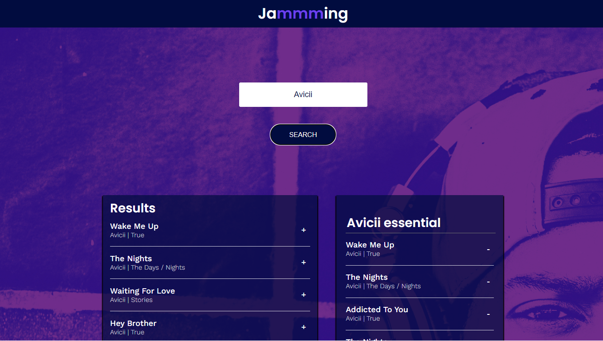
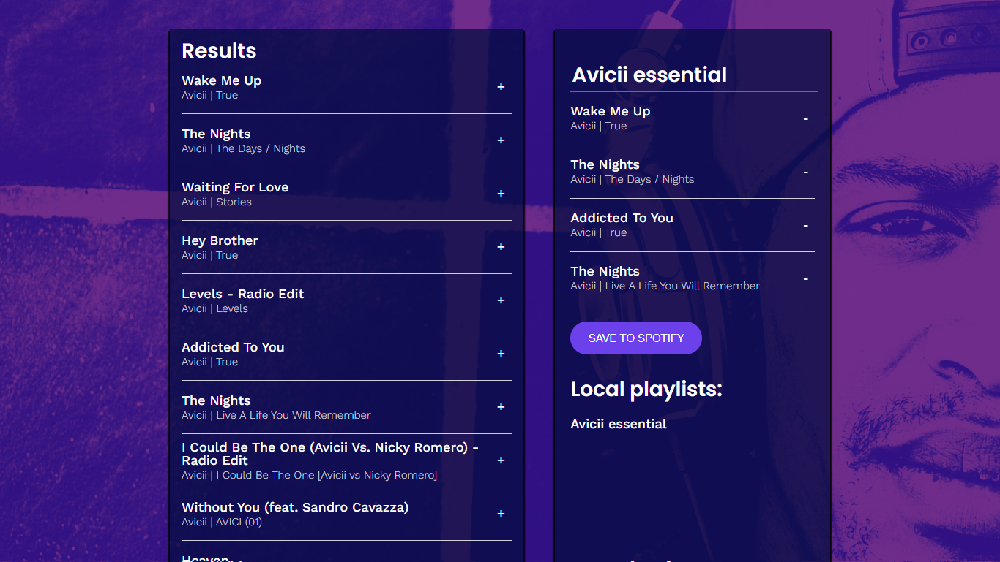

# Jammming Project - Web Development and Front-end Path Project at Codecademy

This is a solution for the [Jammming project at Codecademy](https://www.codecademy.com/paths/web-development/tracks/front-end-applications-with-react/modules/jammming/projects/jammming-prj).

## Table of Contents

- [Overview](#overview)
   - [The Challenge](#the-challenge)
   - [Screenshots and GIFs](#screenshots-and-gifs)
   - [Links](#links)

- [My Process](#my-process)
   - [Built With](#built-with)
   - [What I Learned](#what-i-learned)
   - [Continued Development](#continued-development)
   - [Useful Resources](#useful-resources)

- [Author](#author)
- [Acknowledgments](#acknowledgments)

## Overview

### The Challenge

Build a React web application called Jammming. Utilize your knowledge of React components, passing state, and making requests with the Spotify API to create a website that allows users to search the Spotify library, customize playlists, and save them to their Spotify accounts. The app should use the Implicit Grant Flow to grant users access to their playlist information and permissions to create playlists in their accounts.

### Project Requirements (as stated by Codecademy):

- Implement the [Implicit Grant Flow](https://developer.spotify.com/documentation/web-api/tutorials/implicit-flow) provided by Spotify.
- Complete the challenge instructions.
- Use HTML, CSS, and JavaScript as part of the tech stack.
- Utilize version control with Git and host the repository on GitHub.
- Write a README (using Markdown) that documents your project, including:
   - The project's purpose.
   - Technologies used.
   - Features.
   - Plans for future development.

#### Features

- The website enables users to log in to their Spotify accounts.
- Users can navigate through the website's content by scrolling.
- Users can create new playlists in their Spotify accounts.
- Users can view their existing playlists, select one, and modify its name or add new songs by removing existing songs displayed in the Playlist.jsx component.

#### Prerequisites

- HTML
- CSS
- JavaScript
- React
- Git and GitHub
- HTTP Requests and Responses
- Authentication

### Screenshots and Videos

I have chosen not to deploy the site on Netlify to prevent API key abuse. However, you can find a GIF of the working website in the "public/preview.gif" file:

### Links

- Solution URL: [GitHub Repository](https://github.com/light-roast/jammming)

## My Process

### Built With

- Semantic HTML5 markup
- Custom CSS properties
- Flexbox
- Implicit Grant Flow provided by Spotify
- Responsive design principles
- [React](https://reactjs.org/) - JavaScript library
- [Styled Components](https://styled-components.com/) - Styling framework
- Vite React Create -> Runs with `npm run dev`
- The `.env` file is ignored by Git and contains the API key. To use this project, you need to create your own API key at Yelp, store it in the root `.env` file, and follow this pattern: `VITE_API_KEY= "Bearer api-key-here"`

### What I Learned

Implementing the functional Implicit Grant Flow to the Spotify API was a completely new experience for me. Seeing it in action and making it work was truly exciting. I gained valuable insights from the Spotify documentation, which helped me determine the necessary scope settings for my app's purpose. I also learned how to make requests correctly and understand the expected responses.

### Continued Development

I am eager to delve into the basics of testing for this type of React app. Specifically, I am guided by the question: What aspects of this specific app should I focus on testing?

### Useful Resources

- [Spotify Web API Documentation](https://developer.spotify.com/documentation/web-api)

## Author

- Website: [Daniel Echeverri Llano](https://light-roast.github.io/portafolio/)
- Frontend Mentor: [@light-roast](https://www.frontendmentor.io/profile/light-roast)
- Twitter: [@echeverri_llano](https://www.twitter.com/echeverri_llano)
